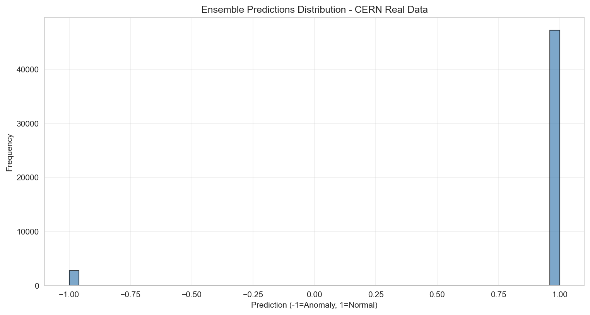
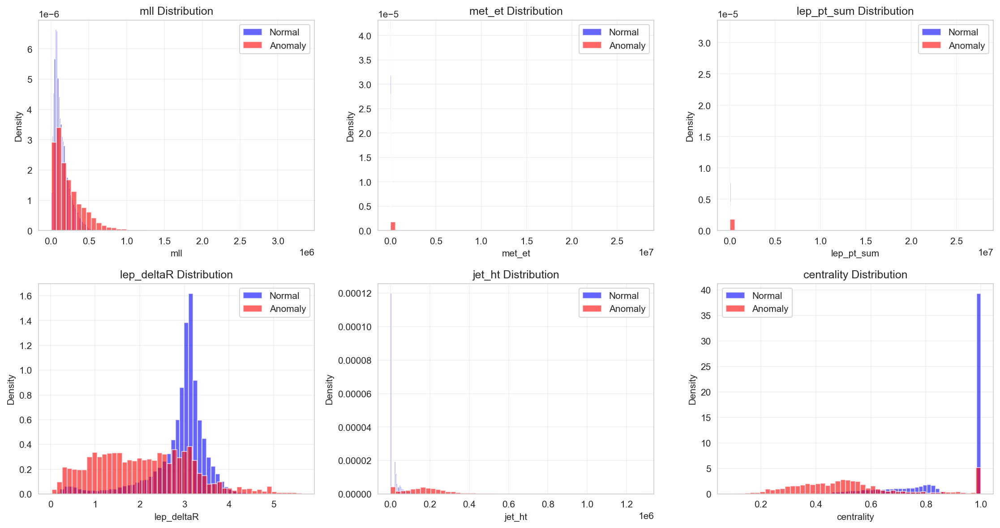
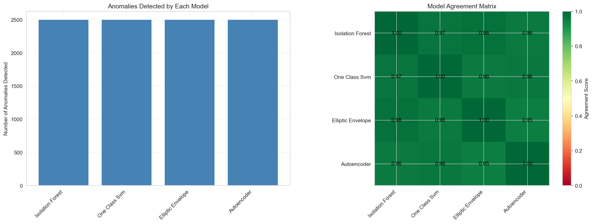
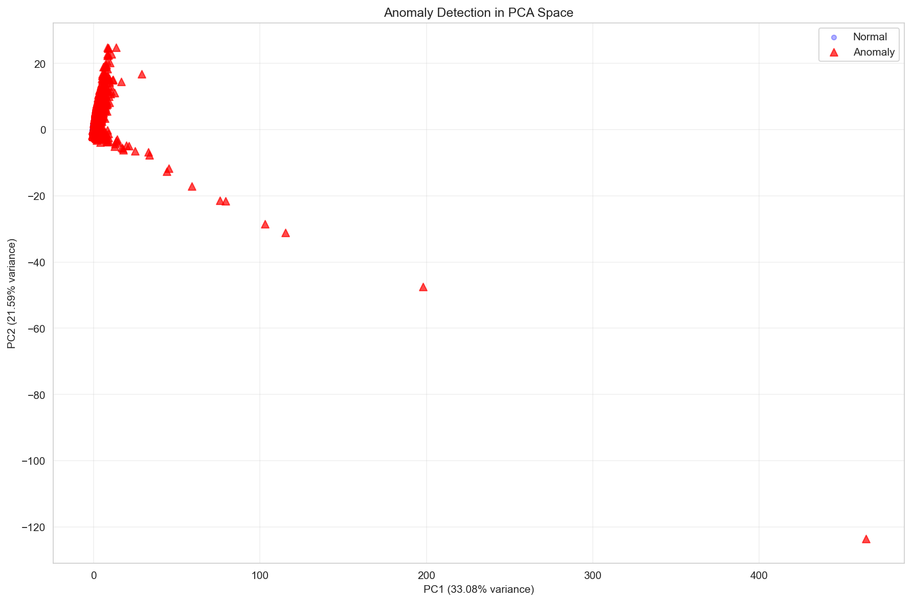

# 🚀 ATLAS Anomaly Detection: Finding the Unusual in Particle Physics


## 🌟 Welcome to the Hunt for Rare Particles!

Have you ever wondered how scientists at CERN discover new particles? It's like looking for a few special needles in a haystack the size of a mountain! That's where this project comes in - we've built a smart computer system that helps spot the most unusual particle collisions from the ATLAS detector at the Large Hadron Collider.

Think of it as a super-powered assistant that never gets tired, can process millions of events, and has a knack for finding the weird ones that might just be signs of new physics!

---

## 🎯 What's This All About?

### The Big Picture

At CERN, scientists smash particles together at nearly the speed of light to see what happens. Most of these collisions follow patterns we already understand from the Standard Model of particle physics. But every once in a while, something truly unusual happens - maybe a new particle we've never seen before!

That's where our system comes in. It uses machine learning to automatically flag the most unusual events, helping physicists focus their attention on the most promising discoveries.

### The Physics (Made Simple)

We're looking at collisions that produce exactly two leptons (electrons or muons - think of them as cousins of the electron). These "dilepton" events are like goldmines for physicists because:

- They're relatively clean and easy to identify
- Many important physics processes create this signature
- New particles might show up as strange patterns in these events

Our system analyzes features like:
- How much energy the leptons have
- The angles between them
- How much energy seems to be "missing" (possibly from invisible particles!)
- The total energy of all particles in the collision

---

## 🛠️ How Does It Work?

Our system is like having four different experts looking at each event, each with their own specialty:

1. **The Autoencoder** (Neural Network): Learns what "normal" events look like and gets confused by unusual ones
2. **The Isolation Forest**: Asks clever questions to quickly spot outliers
3. **The One-Class SVM**: Draws a boundary around normal events and flags anything outside
4. **The Elliptic Envelope**: Measures how far events are from the center of normal data

By combining all four approaches, we get a more reliable system that's less likely to miss important discoveries or get fooled by random chance.

---

## 📊 What Did We Find?

Let's take a look at the results! These visualizations show what our system discovered when analyzing real ATLAS data.

### Overall Anomaly Detection



This chart shows how our system classified events. Most events were labeled as "normal" (1.0), but a small percentage were flagged as "anomalous" (-1.0). These anomalous events are the ones that looked most unusual to our system - the potential needles in our haystack!

### What Makes an Event Unusual?



These colorful histograms compare the characteristics of normal events (blue) versus anomalous events (red). Notice some interesting patterns:

- **mll (invariant mass)**: Anomalous events tend to have higher masses - could these be heavier particles we haven't identified yet?
- **met_et (missing energy)**: Anomalies show more missing energy, suggesting invisible particles might be present
- **lep_pt_sum (total lepton momentum)**: Anomalous events often have higher total momentum
- **centrality**: The distribution of energy in the event differs for anomalies

These patterns are exactly what physicists get excited about when searching for new phenomena!

### Do Our Methods Agree?



This visualization shows how our different detection methods compare. The left panel shows that each method identified roughly the same number of anomalies (around 2,500). The right panel shows the agreement matrix - all methods agreed with each other 95-100% of the time! This high agreement gives us confidence that these aren't just random fluctuations but genuinely unusual events worth investigating further.

### Visualizing Anomalies in 2D Space



To help us visualize high-dimensional data, we used a technique called PCA to squish it down to just two dimensions while keeping the most important patterns. The blue dots represent normal events, while the red triangles are anomalies. Notice how the anomalies form distinct patterns and often appear at the edges of the normal distribution - exactly what we'd expect for truly unusual events!

---

## 🚀 Want to Try It Yourself?

### Getting Started

```bash
# Clone the repository
git clone https://github.com/yourusername/atlas-anomaly-detection.git
cd atlas-anomaly-detection

# Create a virtual environment
python -m venv venv
source venv/bin/activate  # On Windows: venv\Scripts\activate

# Install dependencies
pip install -r requirements.txt
```

### Quick Demo

```python
from atlas_anomaly_detection import ATLASDataLoader, EnsembleAnomalyDetector

# 1. Load ATLAS data
loader = ATLASDataLoader("path/to/data")
data = loader.prepare_data([
    "data_A.exactly2lep.root",
    "data_B.exactly2lep.root"
], max_events_per_file=50000)

# 2. Train our detector
detector = EnsembleAnomalyDetector(contamination=0.05)
detector.fit(data.values)

# 3. Find anomalies!
predictions = detector.predict(test_data.values)
anomalies = test_data[predictions == -1]

print(f"Found {len(anomalies)} unusual events!")
```

### Run the Full Analysis

```bash
# Run complete analysis pipeline
python atlas_anomaly_detector.py

# Try the real-time detection demo
python real_time_detector.py
```

---

## 🌟 Why Does This Matter?

This project is more than just a cool machine learning application - it's helping push the boundaries of human knowledge! Here's why it's important:

1. **Accelerating Discovery**: By automatically identifying unusual events, we can focus human attention on the most promising candidates for new physics.

2. **Finding the Unexpected**: Traditional methods look for specific patterns we expect to see. Our system can spot completely unexpected phenomena.

3. **Handling Big Data**: The LHC produces petabytes of data - far too much for humans to analyze manually. Our system helps sift through this mountain of data efficiently.

4. **Democratizing Physics**: Tools like this make it easier for more people to participate in the search for new particles, not just physicists with specialized training.

---

## 🔮 What's Next?

We're excited about where this project could go! Some ideas for the future:

- **Real-time Processing**: Implementing this system to work in real-time as data comes from the detector
- **Explainable AI**: Adding tools to help understand *why* the system thinks certain events are unusual
- **More Data Types**: Expanding to analyze other types of particle collisions
- **Collaboration with Physicists**: Working directly with researchers to refine the system and investigate the most promising anomalies

---

## 🙏 Acknowledgments

This project wouldn't be possible without:

- The amazing scientists at CERN who make the ATLAS data publicly available
- The open-source community for tools like PyTorch, scikit-learn, and uproot
- Everyone who's contributed to making particle physics more accessible

---

## 📞 Get in Touch

Have questions? Ideas for improvement? Want to collaborate?

- Create an issue on GitHub
- Email: mahdirashidiyan32@gmail.com
- Check out the [ATLAS Open Data portal](http://opendata.atlas.cern)

---

## 📜 License

This project is licensed under the MIT License - see the LICENSE file for details.

---

*Thanks for checking out our project! We hope it inspires you to learn more about particle physics and machine learning. Who knows? Maybe you'll help discover the next breakthrough in our understanding of the universe! 🚀✨*
